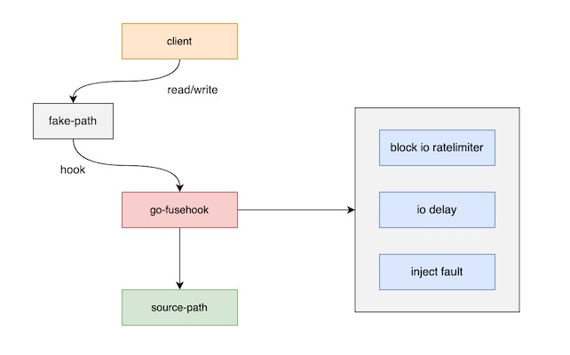

## go-fusehook

**feature**

- control disk's block io rate
- inject io error for custom path
- io delay
- more 



some code from `https://github.com/osrg/hookfs`

### dep

`go-fusehook` is based on `fusermount3` package, so you need to install `fuse3`.

```bash
yum -y install fuse3
```

[go-fuse mount source code](https://github.com/hanwen/go-fuse/blob/934a183ed91446d218b5471c4df9f93db039f6e1/fuse/mount_linux.go)

### Run Example

mount path, control disk's block io rate.

```
$ mkdir -p /mnt/hookfs-test
$ mkdir -p /data/source
$ go build -o blkio cmd/blkio/main.go
$ ./blkio --write-rate=100kb/1s --read-rate=100kb/1s "/mnt/hookfs-test" "/data/source"
^C
```

when blkio process exits, automatically umount path. if can't umount path, manually umount.

```
$ fusermount -u "/mnt/hookfs-test"
```

### API Usage

```go
import (
	"time"

	log "github.com/sirupsen/logrus"
	"golang.org/x/time/rate"

	"github.com/rfyiamcool/go-fusehook/pkg/blkio"
	"github.com/rfyiamcool/go-fusehook/pkg/hookfs"
)

func start(){
	hs := blkio.Hook{}
	hs.ReadLimiter = rate.NewLimiter(rate.Every(time.Second), 500_000)
	hs.WriteLimiter = rate.NewLimiter(rate.Every(5 * time.Second), 100_000)

	fs, err := hookfs.NewHookFs(v.original, v.mountpoint, &hs)
	if err != nil {
		log.Fatal(err)
	}

	v.fuser, err = fs.ServeAsync()
	if err != nil {
		log.Errorf("failed to hookfs serve, err: %s", err.Error())
	}
	...
}
```